# Distracted-Driver-Detection

## Project Overview

This project is done as a part of `Machine Learning` Course.

Driving a car is a complex task, and it requires complete attention. Distracted driving is any activity that takes away the driver’s attention from the road. Approximately 1.35 million people die each year as a result of road traffic crashes.

In this project our aim is to identify whether a driver is driving safely or indulged in distraction activities like texting, drinking etc.We show an in breadth & depth analysis of various features like **HOG, LBP, SURF, KAZE, pixel values** with feature reduction techniques **PCA, LDA** along with normalization techniques such as **min-max** over different classifiers such as **SVM XGBoost, Bagging, AdaBoost, K-Nearest Neighbors, Decision Trees** and compare their performance by tuning different hyperparameters. We evaluate the performance of these classifiers on metrics such as **Accuracy, Precision, Recall, F1 score and ROC**.

Project Poster can be found in [ML-Poster-Final.pdf](ML_Project_End_Term_PPT.pdf).

Project Report can be found in [ML_Project_EndTerm_Report.pdf](ML_Project_End_Term_Report.pdf).

## Dataset
The dataset contains 22424 driver images in total download from [kaggle](https://www.kaggle.com/c/state-farm-distracted-driver-detection/data). The dataset contains coloured images of size 640 x 480 pixels which are resized to 64 X 64 coloured images for training and testing pusposes.
Stratified splitting is used to split the dataset into 80:10 Training-Testing ratio. The training dataset is further split into 90:10 Training-Validation set.

The 10 classes to predict are:
- Safe driving 
- Texting(right hand) 
- Talking on the phone (right hand)
- Texting (left hand) 
- Talking on the phone (left hand)
- Operating the radio 
- Drinking 
- Reaching behind 
- Hair and makeup  
- Talking to passenger(s). 

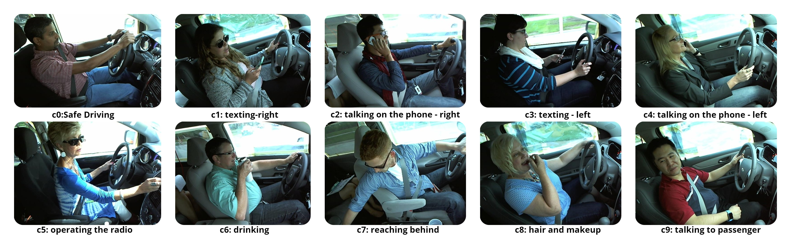

## Algorithm Used

- Different combinations of feature sets were used, some of which are shown in Table 1  (**Ugly Duckling Theorem**) many other combinations were tried.
- Evaluated with different classifiers, model parameters were varied using **Grid Search** to find the best parameters (**No Free Lunch Theorem**).
- Deep learning methods CNN and ResNet-101 also used for classification and Performace visualised using Class Activation Maps (CAMs). 
- In PCA, number of components were preserved using **Elbow method over variance of PCA projected data** (Fig. 2).

## Evaluation Metrics and Results

Follwing are the results of the project:

                                        Fig 1. Feature Visualization
   
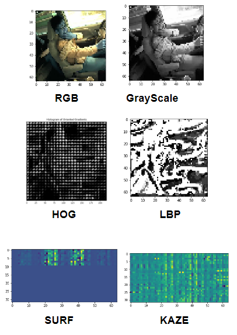
                                         

                                Fig 2. Variance of PCA projected over min-max normalized data

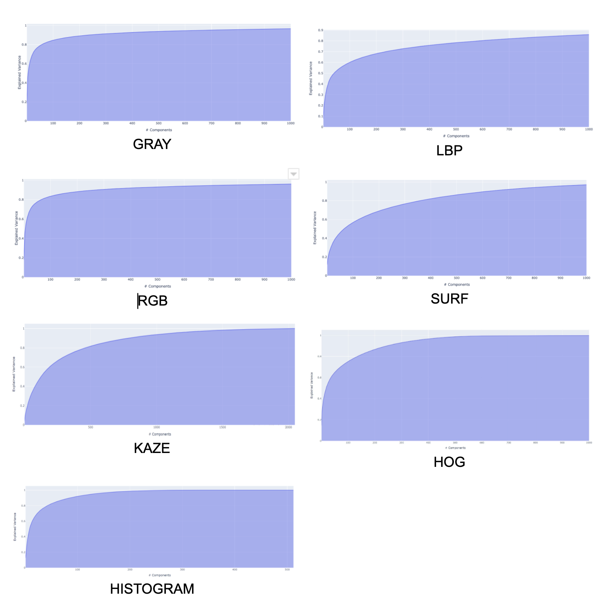

                                Fig 3 Receiver Operating Characteristic (ROC) Curves
                                    a. ROC of PCA reduced data
                                    b. ROC of LDA reduced data
                                    c. ROC of LDA on PCA reduced data

    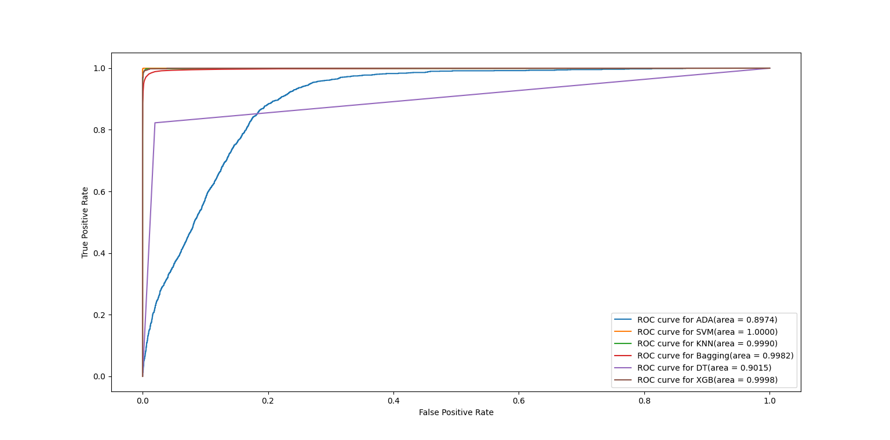
    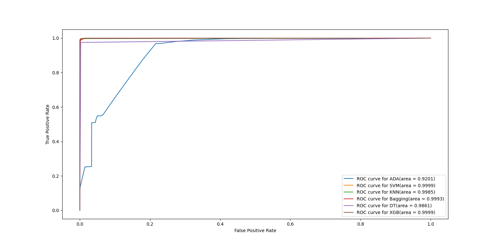
    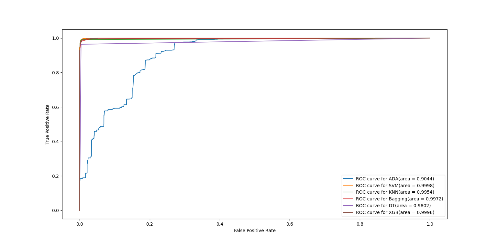

        Fig 4. Optimal Parameters of classifiers after grid search

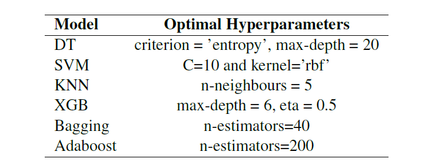

        Fig 5. Comparing various classifiers with different feature sets over Accuracy/Recall/Precision/F1 score
                                    a. Results PCA reduced data
                                    b. Results LDA reduced data
                                    c. Results ROC of LDA on PCA reduced data
         

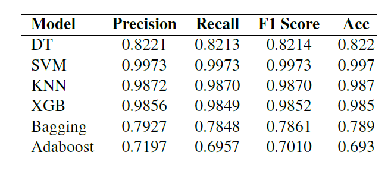

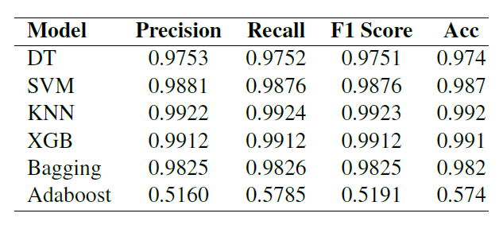

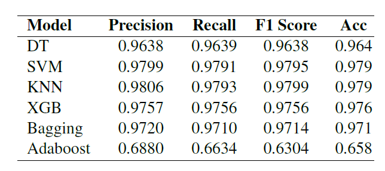

                         Fig 5. CNN architecture used 

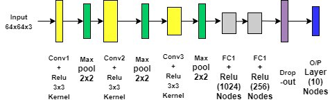

        Fig 6. Comparing between deep learning classifiers with Accuracy/Recall/Precision/F1 score
                                    a. CNN
                                    b. ResNet-101 [Stratery-1 : Retrain only last layer]
                                    c. ResNet-101 [Stratery-2 : Retrain last few layers]

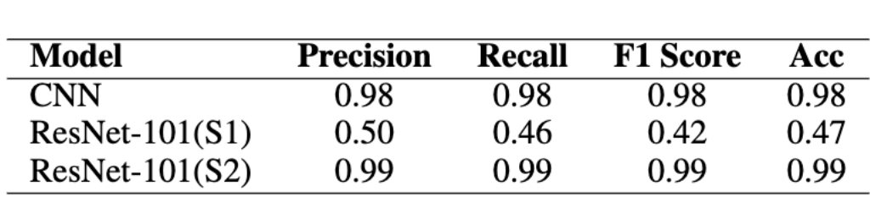

                    Fig 6. ResNet-101 performance measured using Class Activation Maps

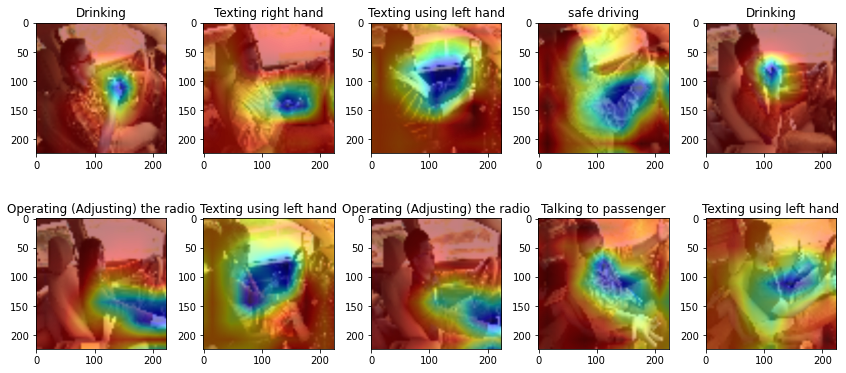

## Interpretation of Results

- Z-score normalization gave better accuracy than min-max normalization (Fig. 8).
- Features were said to be bad because of close to random accuracy i.e. no
differentiating capability.
- Naive Bayes though gives good precision, performs poorly on infected class (recall).
- XGBoost on PCA projected feature set (HOG, LBP, Color Hist, SIFT & RGB) gave the
best metric scores because boosting methods learn for misclassified data as well
and XGB parameters (regularization, gradient descent) help learn better.
- AUC for ROCs of uninfected class show that the trained models are able to
differentiate well.
- Table 2. shows the bad features which are close to random in classification (KAZE).

## References

1. http://cs229.stanford.edu/ proj2019spr/report/24.pdf
2. https://github.com/Raj1036/ ML_Distracted_Driver_Detection/blob/ master/CS539_DistractedDriverDetetion_ FinalProject.pdf
3. H. Eraqi, Y. Abouelnaga, M. Saad, and M. Moustafa, “Driver Distraction Identification with an Ensemble of Convolutional Neural Networks”, Journal of Advanced Transportation 2019, 1-12; doi: 10.1155/2019/4125865
4. 

## Project Team Members

1. Akanksha Shrimal
2. Akhil Mahajan 
3. Prabal Jain 